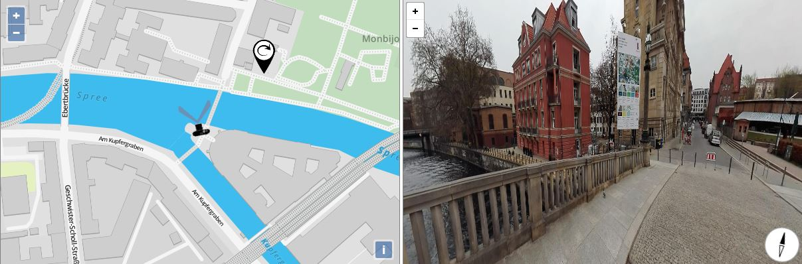

<h1>Map and Panorama/photosphere Viewer </h1>        

Nowadays there is a boom in 360° panoramic images due to the ever-reducing cost of the technology, 
    availability of software (<a href="http://wiki.panotools.org/Windows_software#Stitching_Software">stitching programs</a> or applications for smart phones) and the possibility to embed them onto a web page. Even with my basic mobile phone (cost 200 €) I was able to generate a simple panoramic image!

This example shows how to connect a map to 360° panorama. Map and panorama are reciprocally related: the click on a icon on the map opens the correspondent panorama. And the navigation in the panorama update the rotation of the icon in the map.  

I use the lightweight but powerfull Javascript library Viewer <a href="https://pannellum.org/">Pannellum</a> to show the panorama  

    <a href="https://cdn.rawgit.com/pafavero/photosphere/master/index.html" target="_blank" >Show preview</a>

        